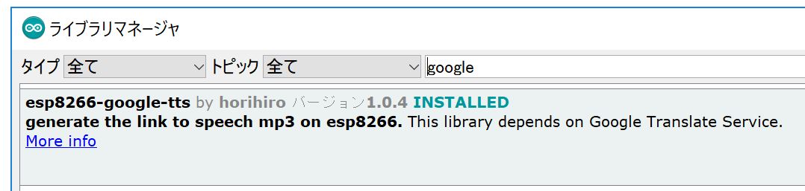

# esp8266-google-tts
Simple Google TTS Library for esp8266.

This library generates the link to speech mp3 file from text using Google Translate Service.

[This](https://qiita.com/horihiro/items/d64b699d06605ad44646) is the Japanese document on [Qiita.com](https://qiita.com/);

## Install
This library can be installed from the Library Manager on Arduino IDE




## Usage

```
#include <google-tts.h>
#include <ESP8266WiFi.h>

const char* ssid     = "<REPLASE_YOUR_WIFI_SSID>";
const char* password = "<REPLASE_YOUR_WIFI_PASSWORD>";

void setup() {
  // put your setup code here, to run once:
  Serial.begin(115200);
  Serial.println("");
  WiFi.mode(WIFI_STA);  WiFi.begin(ssid, password);

  while (WiFi.status() != WL_CONNECTED) {
    delay(250);
    Serial.print(".");
  }

  TTS tts;
  Serial.println(tts.getSpeechUrl("こんにちは、世界！", "ja"));
  Serial.println(tts.getSpeechUrl("Hello, World!"));

}

void loop() {
  // put your main code here, to run repeatedly:

}
```
